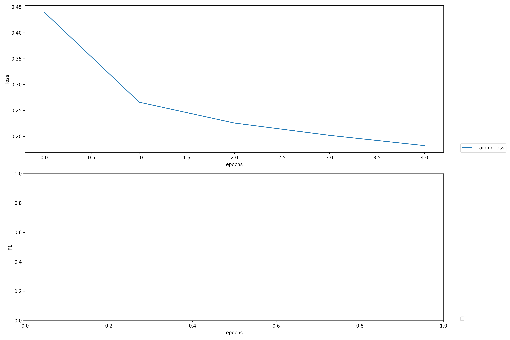

# MomentoRetroalimentacionModulo3

The most important step to take to be able to run the code is to add the datasets to the directory, they have to be manually added because they surpass github's file size limit. They have to be added to the project root directory.
```
MomentoRetroalimentacionModulo3
│   README.md
│   Python files
|   europarl-v7.es-en.es
|   europarl-v7.es-en.en
│
└───NERData
│   │   dev
│   │   train
|   |   test
|   |   train_trunc
```

To run the code simple use this command
`python run.py`

No API Keys needed.

